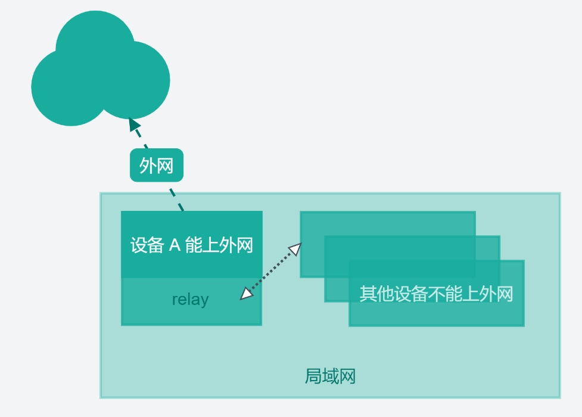
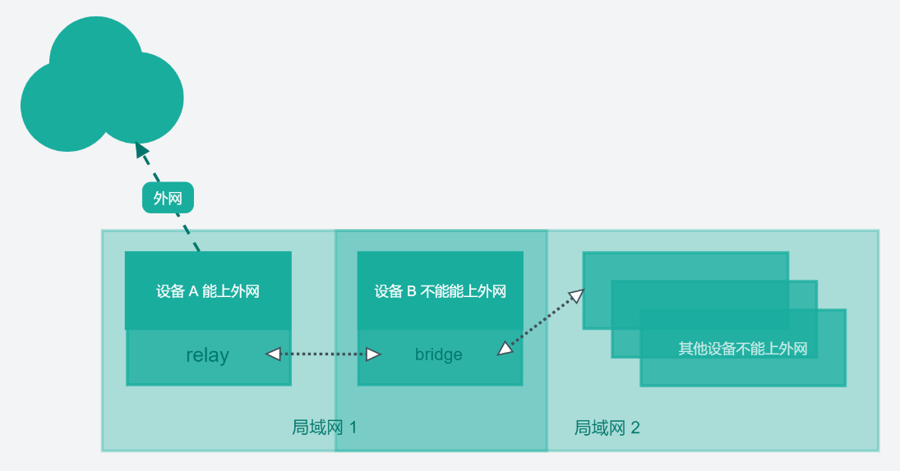

# LightProxy

+ **LightProxy** 提供了桥接，代理上网等功能。适用于在同一局域网内，设备A能上网，设备B不能上网的情况（此时，设备B可以通过LightProxy借助设备A上网）。

+ 特别是工厂的环境，很多检测服务器为了安全是不能上网的，只有用于远程的 PC 能上网，此时通过 **LightProxy** 可以将 PC 的代理服务桥接到设备B上，让设备B也能临时上网。

## relay (代理上网)

+ 流程图：



+ 命令：

```shell
# 1. 代理转发（默认端口：8080）
proxy relay

# 2. 代理转发，指定端口
proxy relay --port 8000
```
## bridge (桥接转发)

+ 流程图：



+ 命令：

```shell
# 1. 桥接转发（默认端口：8080）
proxy bridge --relay 192.168.1.3:8080

# 2. 桥接转发，指定端口
proxy bridge --relay 192.168.1.3:8080 --port 8000
```

## config (配置管理)

```shell
# 1. 清除配置
sudo proxy config --set 0

# 2. 设置配置（set 后面的参数为 [relay 所在服务器的IP]:[relay 指定的端口]）
sudo proxy config --set 192.168.1.3:8080
```
